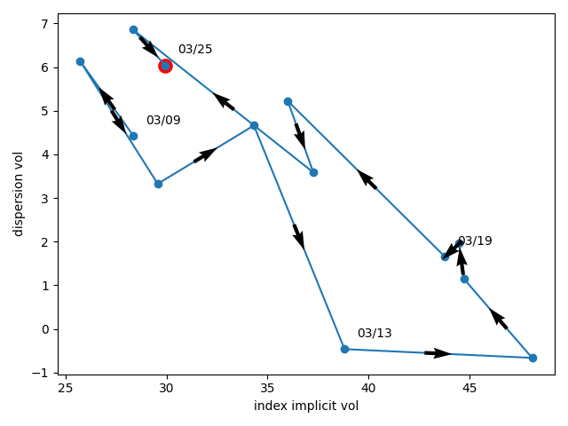

# Timing Dispersion Strategy (requires Deutsche Boerse A7 access) #
## A simple way to know when to enter dispersion strategy ##

**This project showcases the possibilities offered by the API of Deutsche Boerse's A7 service. You will need a valid A7 subscription to run it. For this, please go to :
https://www.mds.deutsche-boerse.com/mds-en/analytics/A7-analytics-platform  **

**Once you have been registered as a A7 user, connect to the A7 website in order to get an API token : https://a7.deutsche-boerse.com/ 
After logging in, click on the face icon next to your name on the top right of the page and then select API Token generation.**

A Dispersion Strategy is a way for option traders to take advantage of the premium in index implicit volatility compared to single stock's volatility.

This premium stems from different leading flows in each asset class :
- Global hedge (through options buying) for index options
- Overwriting (through options selling) for single stocks options

See a more detailed explanation at :
https://blog.quantinsti.com/dispersion-trading-using-options/#:~:text=The%20Dispersion%20Trading%20is%20a,than%20between%20individual%20stock%20options.

A dispersion strategy is sometimes said to be equivalent to trading the intra index correlation but it is a misleading approach.
The purest form of dispersion is via Varswap on index vs Varswap on underlyings.
This is not how it is traded nowadays though, as varswaps are deemed too dangerous in market dislocation scenarios, but options based dispersion portfollio can locally replicate varswap trades. For this reason, the varswap approach can still be a good way to evaluate a dispersion strategy.

The Dispersion Volatility measure is :

### Dispersion_Vol = ( Sum(i=1..n, W_i * ATF_i^2) - (1+Leverage) * ATF_index^2 ) / Normalisation_factor ###

where

- ATF_i is the ATM Forward implicit vol of the ith stock in the index
- ATF_index is the ATM Forward implicit vol of the index
- Leverage is the additional notional of index varswap to sell in order to get a vega neutral dispersion. Typically 20%.
- W_i is the weight of the ith component in the index
- Normalisation_factor is a factor to apply to get a vega of 1 on the index : 2 * (1+Leverage) * ATF_index

## Explanation : ##
The Dispersion Vol is a measure of the price of a varswap dispersion strategy with a leverage on the index in order to target a vega neutral portfolio.

This indicator can of course also be computed in a realized form instead of implicit, simply by inputing realized volatilities instead. 
The PnL of the dispersion strategy will then be very straight forward :
PnL = Dispersion_Vol_Realized - Dispersion_Vol_Implicit

Consequently, the lower the implicit Dispersion_Vol, the higher the chances of positive reward.

## What we will be doing : ##

Option traders know that when markets collapse, the index vol overshoots the vol of components which generates dispersion trade opportunities.
Visually, this creates a clockwise pattern on a graph representing the Dispersion_Vol on the Y axis and the index implicit vol on the X axis in case of market stress :
- First index vol rises and overshoots stock vol so the dispersion vol goes down -> the curve moves to right and lower.
- Then the stock vol rises pushing the disp vol higher so the curve moves up.
- Finally, the market settles and reverts to its original level completing the anti clockwise trajectory.

So, by comparing our present position on the graph to past positions, we can detect which phase of the cycle we are in.
This will help us to better time our dispersion trade (ie. when the Dispersion Vol is at it's lowest).

The goal of this git is to show how to create this graph using Deutsche Boerse's A7 API.

## Here are some examples : ##

March 2020 market meltdown :

January 2020 :

Nov 2019 to Oct 2020 :

